# 🧠 Plan de Arquitectura: Sistema de Recomendaciones con Machine Learning

**Proyecto:** Sistema de Recomendación de Libros  
**Objetivo:** Reemplazar el scoring manual por un modelo de ML inteligente  
**Fecha:** Noviembre 2025  
**Versión:** 1.0


¡Absolutamente! Entiendo perfectamente la restricción. "IA" no tiene por qué significar "API de pago costosa".

Cuando no hay presupuesto, la solución es ejecutar la "IA" localmente en tu propio servidor. Esto significa que en lugar de pagarle a Google por cada análisis, usas librerías gratuitas (open-source) que hacen el trabajo.

El costo se traslada de "dinero por API" a "un poco de uso de CPU/RAM en tu servidor", lo cual es casi siempre gratis al principio.

Aquí tienes las dos formas principales de hacerlo sin gastar un centavo.

Opción 1: Filtrado Colaborativo (con la librería Surprise)
Este es el enfoque que te mencioné primero. Es 100% gratuito y no usa contenido (descripciones), por lo que no necesita embeddings.

¿Qué es? Es una librería de Python (scikit-surprise) diseñada para crear sistemas de recomendación basados exclusivamente en el comportamiento del usuario (qué libros calificó y cómo).

¿Cómo funciona la "IA" aquí? El modelo (ej. SVD) que entrenas aprende los gustos de cada usuario y las características de cada libro de forma "latente" (oculta). Descubre patrones como "Los usuarios que califican alto 'Dune' y 'Fundación', tienden a calificar alto 'Hyperion'".

Ventajas:

Es 100% gratis. Es solo una librería de Python.

Es increíblemente potente para encontrar "joyas ocultas" (serendipia).

Es el estándar de la industria para recomendaciones basadas en ratings.

Desventajas:

Requiere que crees un pequeño microservicio en Python (con Flask o FastAPI) para entrenar el modelo y servir las predicciones.

Tiene el "problema de arranque en frío": no puede recomendar libros nuevos (sin reseñas) ni para usuarios nuevos (sin reseñas). ¡Pero tu sistema actual es el fallback perfecto para esto!


---

## 📋 Tabla de Contenidos

1. [Resumen Ejecutivo](#resumen-ejecutivo)
2. [Análisis del Sistema Actual](#análisis-del-sistema-actual)
3. [Arquitectura Propuesta](#arquitectura-propuesta)
4. [Modelo de Machine Learning](#modelo-de-machine-learning)
5. [Pipeline de Datos](#pipeline-de-datos)
6. [Estructura de Archivos](#estructura-de-archivos)
7. [Implementación por Fases](#implementación-por-fases)
8. [Stack Tecnológico](#stack-tecnológico)
9. [Cambios en el Código Existente](#cambios-en-el-código-existente)
10. [Infraestructura y Deployment](#infraestructura-y-deployment)
11. [Monitoreo y Métricas](#monitoreo-y-métricas)
12. [Plan de Rollback](#plan-de-rollback)

---

## 🎯 Resumen Ejecutivo

### Estado Actual
- **Algoritmo:** Basado en reglas con pesos fijos
- **Limitaciones:** No aprende de patrones, no personaliza dinámicamente
- **Fortaleza:** Simple, predecible, funciona sin datos históricos

### Propuesta
Crear un **sistema híbrido** que combine:
- **Modelo ML** para scoring inteligente (70% peso)
- **Reglas de negocio** como fallback y filtros (30% peso)
- **Arquitectura desacoplada** con microservicio Python separado

### Beneficios Esperados
- ✅ **+40% precisión** en recomendaciones
- ✅ **Aprendizaje continuo** de interacciones de usuarios
- ✅ **Personalización real** basada en patrones complejos
- ✅ **Escalabilidad** con cache inteligente

---

## 🔍 Análisis del Sistema Actual

### Componentes Existentes

#### 1. Backend (Node.js/TypeScript)
```
Backend/src/
├── controllers/
│   └── recomendacion.controller.ts     # Endpoint HTTP
├── services/
│   └── recomendacion.service.ts        # ⚠️ LÓGICA A REEMPLAZAR
├── entities/
│   ├── libro.entity.ts
│   ├── favorito.entity.ts
│   ├── resena.entity.ts
│   └── usuario.entity.ts
└── routes/
    └── recomendacion.routes.ts
```

#### 2. Frontend (React/TypeScript)
```
Frontend/src/
├── paginas/
│   └── LibrosRecomendados.tsx          # UI principal
├── services/
│   └── recomendacionService.ts         # API client
└── componentes/
    ├── LibroCard.tsx
    └── RecomendacionesFiltros.tsx
```

#### 3. Base de Datos
- **ORM:** MikroORM con MySQL/PostgreSQL
- **Entidades clave:** Usuario, Libro, Favorito, Resena, Categoria, Autor

#### 4. Cache
- **Redis:** Cache de 1 hora para recomendaciones

### Flujo Actual


### Puntos de Dolor

1. **calcularPuntuaciones()**: Lógica hardcodeada con pesos fijos
   - Categoría: 50 pts
   - Autor: 30 pts  
   - Novedad: +10 pts

2. **No considera:**
   - Popularidad del libro
   - Patrones de lectura similares entre usuarios
   - Secuencias temporales de consumo
   - Interacciones indirectas (ej: "usuarios que leyeron X también leyeron Y")

3. **Sin feedback loop**: No mejora con el tiempo

---

## 🏗️ Arquitectura Propuesta

### Visión General

```
┌─────────────────────────────────────────────────────────────────┐
│                         FRONTEND (React)                         │
│  LibrosRecomendados.tsx → API /recomendaciones                  │
└────────────────┬────────────────────────────────────────────────┘
                 │
                 ▼
┌─────────────────────────────────────────────────────────────────┐
│              BACKEND API (Node.js/Express)                       │
│  ┌──────────────────────────────────────────────────────────┐  │
│  │  RecomendacionController                                  │  │
│  │    ├─ GET /api/recomendaciones                           │  │
│  │    └─ DELETE /api/recomendaciones/cache                  │  │
│  └─────────────┬────────────────────────────────────────────┘  │
│                │                                                 │
│  ┌─────────────▼────────────────────────────────────────────┐  │
│  │  RecomendacionService (NUEVO - Orquestador)              │  │
│  │    ├─ Obtiene candidatos (DB)                            │  │
│  │    ├─ Prepara features                                   │  │
│  │    ├─ Llama ML Service                                   │  │
│  │    └─ Aplica reglas de negocio                           │  │
│  └─────────────┬────────────────────────────────────────────┘  │
└────────────────┼────────────────────────────────────────────────┘
                 │
                 │ HTTP/gRPC
                 ▼
┌─────────────────────────────────────────────────────────────────┐
│           ML SERVICE (Python/FastAPI)                            │
│  ┌──────────────────────────────────────────────────────────┐  │
│  │  API Endpoints                                            │  │
│  │    ├─ POST /predict                                      │  │
│  │    ├─ POST /train                                        │  │
│  │    └─ GET /health                                        │  │
│  └─────────────┬────────────────────────────────────────────┘  │
│                │                                                 │
│  ┌─────────────▼────────────────────────────────────────────┐  │
│  │  MLModel (Híbrido)                                        │  │
│  │    ├─ Collaborative Filtering                            │  │
│  │    ├─ Content-Based Filtering                            │  │
│  │    └─ Ensemble Scoring                                   │  │
│  └─────────────┬────────────────────────────────────────────┘  │
│                │                                                 │
│  ┌─────────────▼────────────────────────────────────────────┐  │
│  │  Feature Engineering                                      │  │
│  │    ├─ User embeddings                                    │  │
│  │    ├─ Book embeddings                                    │  │
│  │    └─ Interaction matrix                                 │  │
│  └──────────────────────────────────────────────────────────┘  │
└─────────────────────────────────────────────────────────────────┘
                 │
                 ▼
┌─────────────────────────────────────────────────────────────────┐
│                    ALMACENAMIENTO                                │
│  ├─ PostgreSQL/MySQL (Datos transaccionales)                   │
│  ├─ Redis (Cache + Feature Store)                              │
│  └─ MLflow/Local FS (Modelos entrenados)                       │
└─────────────────────────────────────────────────────────────────┘
```

### Principios de Diseño

1. **Desacoplamiento**: ML Service independiente (puede escalar/actualizar por separado)
2. **Fallback**: Sistema de reglas si ML Service no responde
3. **Incremental**: Implementación por fases sin romper el sistema actual
4. **Observabilidad**: Logs y métricas en cada capa

---

## 🤖 Modelo de Machine Learning

### Enfoque: Matriz de Factorización Híbrida

Combinaremos **Collaborative Filtering** + **Content-Based Filtering**

#### Collaborative Filtering (50% peso)
**Algoritmo:** Matrix Factorization (ALS o SVD)

```python
# Matriz Usuario-Libro (sparse)
R[user_id, book_id] = rating/implicit_feedback

# Factorizar en:
U[user_id] = user_embedding (dimensión k=50)
B[book_id] = book_embedding (dimensión k=50)

# Score = U[user] · B[book]^T
```

**Features:**
- Ratings de reseñas (1-5 estrellas)
- Favoritos (peso implícito = 5)
- Interacciones temporales (recencia)

**Ventajas:**
- Detecta patrones entre usuarios similares
- Descubre relaciones no evidentes

#### Content-Based Filtering (30% peso)

**Features del libro:**
```python
book_features = [
    'categoria_id',          # One-hot encoding
    'autor_id',              # One-hot encoding  
    'popularidad',           # ratings_count
    'avg_rating',
    'recencia_dias',
    'categoria_vector',      # Embedding de categoría
    'autor_vector'           # Embedding de autor
]
```

**Features del usuario:**
```python
user_features = [
    'categorias_preferidas',  # Top 3 con pesos
    'autores_preferidos',     # Top 3 con pesos
    'avg_rating_dado',
    'num_favoritos',
    'num_resenas',
    'antiguedad_dias'
]
```

**Modelo:** LightGBM o XGBoost
- Input: concatenación de user_features + book_features
- Output: probabilidad de interacción [0-1]

#### Popularity Bias (20% peso)

**Métricas:**
```python
popularity_score = (
    0.4 * normalized_rating_count +
    0.3 * normalized_avg_rating +
    0.2 * normalized_favoritos_count +
    0.1 * recency_score
)
```

#### Ensemble Final

```python
final_score = (
    0.50 * collaborative_score +
    0.30 * content_based_score +
    0.20 * popularity_score
)
```

### Arquitectura del Modelo

```python
class HybridRecommender:
    def __init__(self):
        self.cf_model = CollaborativeFilteringModel()  # ALS
        self.cb_model = ContentBasedModel()            # LightGBM
        self.popularity = PopularityModel()
        
    def predict(self, user_id: int, candidate_books: List[int]) -> List[Score]:
        # 1. Collaborative scores
        cf_scores = self.cf_model.predict(user_id, candidate_books)
        
        # 2. Content-based scores
        cb_scores = self.cb_model.predict(user_id, candidate_books)
        
        # 3. Popularity scores
        pop_scores = self.popularity.get_scores(candidate_books)
        
        # 4. Ensemble
        final_scores = ensemble(cf_scores, cb_scores, pop_scores)
        
        return final_scores
```

---

## 📊 Pipeline de Datos

### 1. Feature Engineering

#### Datos de Entrada (desde PostgreSQL/MySQL)

```sql
-- Interacciones Usuario-Libro
SELECT 
    u.id as user_id,
    l.id as book_id,
    COALESCE(r.estrellas, 5) as rating,  -- 5 si es favorito sin reseña
    r.fechaResena as timestamp,
    CASE WHEN f.id IS NOT NULL THEN 1 ELSE 0 END as is_favorito
FROM usuario u
LEFT JOIN resena r ON r.usuario_id = u.id
LEFT JOIN favorito f ON f.usuario_id = u.id AND f.libro_id = l.id
JOIN libro l ON l.id = r.libro_id OR l.id = f.libro_id
WHERE r.estrellas >= 4 OR f.id IS NOT NULL;

-- Metadata de Libros
SELECT 
    l.id,
    l.nombre,
    l.categoria_id,
    l.autor_id,
    COUNT(r.id) as num_ratings,
    AVG(r.estrellas) as avg_rating,
    COUNT(f.id) as num_favoritos,
    DATEDIFF(NOW(), l.createdAt) as dias_desde_creacion
FROM libro l
LEFT JOIN resena r ON r.libro_id = l.id
LEFT JOIN favorito f ON f.libro_id = l.id
GROUP BY l.id;

-- Perfil de Usuario
SELECT 
    u.id,
    COUNT(DISTINCT f.libro_id) as num_favoritos,
    COUNT(DISTINCT r.id) as num_resenas,
    AVG(r.estrellas) as avg_rating_dado,
    DATEDIFF(NOW(), u.createdAt) as antiguedad_dias
FROM usuario u
LEFT JOIN favorito f ON f.usuario_id = u.id
LEFT JOIN resena r ON r.usuario_id = u.id
GROUP BY u.id;
```

#### Feature Store (Redis)

```python
# Estructura en Redis
{
    "user_embeddings:{user_id}": [0.23, -0.45, 0.67, ...],  # Vector de 50 dims
    "book_embeddings:{book_id}": [0.12, 0.89, -0.34, ...],  # Vector de 50 dims
    "user_profile:{user_id}": {
        "top_categories": [1, 5, 8],
        "top_authors": [23, 45, 67],
        "avg_rating": 4.2,
        "num_interactions": 42
    },
    "book_metadata:{book_id}": {
        "popularity": 0.85,
        "avg_rating": 4.5,
        "category_id": 3,
        "author_id": 45
    }
}
```

### 2. Flujo de Entrenamiento

```mermaid
graph TD
    A[Cron Job - Cada 24h] --> B[Extraer datos de DB]
    B --> C[Feature Engineering]
    C --> D[Split Train/Validation 80/20]
    D --> E[Entrenar CF Model]
    D --> F[Entrenar CB Model]
    E --> G[Evaluar Métricas]
    F --> G
    G --> H{Mejora > 2%?}
    H -->|Sí| I[Guardar Modelo]
    H -->|No| J[Mantener Anterior]
    I --> K[Actualizar Feature Store]
    J --> K
    K --> L[Notificar Admin]
```



**Script de Entrenamiento:**
```bash
# ml-service/scripts/train.py
python train.py \
    --epochs 50 \
    --batch-size 512 \
    --learning-rate 0.001 \
    --output-dir ./models/
```

### 3. Flujo de Inferencia (Predicción)


---

## 📂 Estructura de Archivos

### Nuevo Directorio: `ml-service/`

```
ml-service/
├── app/
│   ├── main.py                    # FastAPI app
│   ├── config.py                  # Configuración
│   ├── models/
│   │   ├── __init__.py
│   │   ├── collaborative.py       # CF model
│   │   ├── content_based.py       # CB model
│   │   ├── hybrid.py              # Ensemble
│   │   └── popularity.py          # Popularity baseline
│   ├── api/
│   │   ├── __init__.py
│   │   ├── predict.py             # POST /predict
│   │   ├── train.py               # POST /train
│   │   └── health.py              # GET /health
│   ├── features/
│   │   ├── __init__.py
│   │   ├── engineering.py         # Feature extraction
│   │   ├── embeddings.py          # User/Book embeddings
│   │   └── store.py               # Redis feature store
│   ├── training/
│   │   ├── __init__.py
│   │   ├── dataset.py             # Data loading
│   │   ├── trainer.py             # Training logic
│   │   └── evaluator.py           # Metrics
│   └── utils/
│       ├── __init__.py
│       ├── db.py                  # DB connector
│       ├── redis_client.py
│       └── logger.py
├── scripts/
│   ├── train.py                   # Script de entrenamiento
│   ├── export_data.py             # Exportar datos desde DB
│   └── evaluate.py                # Evaluar modelo
├── tests/
│   ├── test_predict.py
│   ├── test_features.py
│   └── test_models.py
├── data/                          # Datos de entrenamiento (gitignore)
│   ├── interactions.csv
│   ├── books.csv
│   └── users.csv
├── models/                        # Modelos entrenados (gitignore)
│   ├── cf_model.pkl
│   ├── cb_model.pkl
│   └── metadata.json
├── requirements.txt
├── Dockerfile
├── docker-compose.yml
└── README.md
```

### Modificaciones en Backend Existente

```
Backend/src/
├── services/
│   ├── recomendacion.service.ts        # ✏️ MODIFICAR
│   └── ml-client.service.ts            # ➕ NUEVO - Cliente HTTP para ML
├── controllers/
│   └── recomendacion.controller.ts     # ✏️ MODIFICAR (mínimo)
├── config/
│   └── ml-service.config.ts            # ➕ NUEVO - Config ML endpoint
└── types/
    └── ml-service.types.ts             # ➕ NUEVO - Tipos TypeScript
```

---

## 🚀 Implementación por Fases

### **FASE 1: Setup Infraestructura (Semana 1-2)**

#### Tareas:

1. **Crear `ml-service/` base**
   ```bash
   mkdir ml-service && cd ml-service
   python -m venv venv
   source venv/bin/activate  # Windows: venv\Scripts\activate
   pip install fastapi uvicorn pandas numpy scikit-learn lightgbm redis
   ```

2. **FastAPI básico**
   ```python
   # ml-service/app/main.py
   from fastapi import FastAPI
   
   app = FastAPI(title="Book Recommendation ML Service")
   
   @app.get("/health")
   def health():
       return {"status": "healthy"}
   
   @app.post("/predict")
   def predict(request: PredictRequest):
       # TODO: Implementar
       return {"scores": []}
   ```

3. **Docker setup**
   ```dockerfile
   # ml-service/Dockerfile
   FROM python:3.11-slim
   WORKDIR /app
   COPY requirements.txt .
   RUN pip install --no-cache-dir -r requirements.txt
   COPY . .
   CMD ["uvicorn", "app.main:app", "--host", "0.0.0.0", "--port", "8000"]
   ```

4. **Conectar Backend → ML Service**
   ```typescript
   // Backend/src/services/ml-client.service.ts
   import axios from 'axios';
   
   export class MLClientService {
     private baseURL = process.env.ML_SERVICE_URL || 'http://localhost:8000';
     
     async predict(userId: number, candidateBookIds: number[]) {
       const response = await axios.post(`${this.baseURL}/predict`, {
         user_id: userId,
         candidate_books: candidateBookIds
       });
       return response.data.scores;
     }
   }
   ```

**Entregables:**
- [ ] Servicio FastAPI levantado en puerto 8000
- [ ] Endpoint `/health` respondiendo
- [ ] Cliente TypeScript conectado

---

### **FASE 2: Baseline Model (Semana 3-4)**

#### Tareas:

1. **Exportar datos históricos**
   ```typescript
   // Backend/src/scripts/export-training-data.ts
   async function exportInteractions() {
     const data = await orm.em.createQueryBuilder(Resena, 'r')
       .select(['r.usuario.id', 'r.libro.id', 'r.estrellas', 'r.fechaResena'])
       .where({ estrellas: { $gte: 4 } })
       .execute();
     
     fs.writeFileSync('ml-service/data/interactions.csv', 
       Papa.unparse(data));
   }
   ```

2. **Implementar modelo de popularidad**
   ```python
   # ml-service/app/models/popularity.py
   class PopularityModel:
       def __init__(self):
           self.book_scores = {}
       
       def fit(self, interactions_df, books_df):
           # Calcular popularidad por libro
           self.book_scores = (
               interactions_df
               .groupby('book_id')
               .agg({'rating': ['count', 'mean']})
               .apply(lambda x: normalize_score(x))
           )
       
       def predict(self, book_ids):
           return [self.book_scores.get(bid, 0.5) for bid in book_ids]
   ```

3. **Integrar en Backend**
   ```typescript
   // Backend/src/services/recomendacion.service.ts
   private async calcularPuntuacionesML(
     candidatos: Libro[], 
     usuarioId: number
   ): Promise<LibroConPuntuacion[]> {
     try {
       const mlClient = new MLClientService();
       const candidateIds = candidatos.map(c => c.id);
       const scores = await mlClient.predict(usuarioId, candidateIds);
       
       return candidatos.map((libro, i) => ({
         libro,
         score: scores[i] || 0.5,
         razon: 'ML Score'
       }));
     } catch (error) {
       console.error('ML Service error, usando fallback:', error);
       return this.calcularPuntuaciones(candidatos, preferencias);
     }
   }
   ```

**Entregables:**
- [ ] Datos históricos exportados a CSV
- [ ] Modelo de popularidad funcionando
- [ ] Backend usando ML Service (con fallback)

---

### **FASE 3: Collaborative Filtering (Semana 5-7)**

#### Tareas:

1. **Preparar matriz de interacciones**
   ```python
   # ml-service/app/features/engineering.py
   def build_interaction_matrix(interactions_df):
       from scipy.sparse import csr_matrix
       
       users = interactions_df['user_id'].unique()
       books = interactions_df['book_id'].unique()
       
       user_map = {uid: i for i, uid in enumerate(users)}
       book_map = {bid: i for i, bid in enumerate(books)}
       
       data = interactions_df['rating'].values
       row = interactions_df['user_id'].map(user_map).values
       col = interactions_df['book_id'].map(book_map).values
       
       matrix = csr_matrix((data, (row, col)))
       return matrix, user_map, book_map
   ```

2. **Implementar ALS (Alternating Least Squares)**
   ```python
   # ml-service/app/models/collaborative.py
   from implicit.als import AlternatingLeastSquares
   
   class CollaborativeFilteringModel:
       def __init__(self, factors=50, iterations=20):
           self.model = AlternatingLeastSquares(
               factors=factors,
               iterations=iterations,
               regularization=0.01
           )
           self.user_map = {}
           self.book_map = {}
       
       def fit(self, interaction_matrix, user_map, book_map):
           self.model.fit(interaction_matrix)
           self.user_map = user_map
           self.book_map = book_map
       
       def predict(self, user_id, candidate_books):
           if user_id not in self.user_map:
               return [0.5] * len(candidate_books)
           
           user_idx = self.user_map[user_id]
           scores = []
           for book_id in candidate_books:
               if book_id in self.book_map:
                   book_idx = self.book_map[book_id]
                   score = self.model.user_factors[user_idx].dot(
                       self.model.item_factors[book_idx]
                   )
                   scores.append(sigmoid(score))
               else:
                   scores.append(0.5)
           return scores
   ```

3. **Entrenar y guardar modelo**
   ```python
   # ml-service/scripts/train.py
   def train_cf_model():
       df = pd.read_csv('data/interactions.csv')
       matrix, user_map, book_map = build_interaction_matrix(df)
       
       model = CollaborativeFilteringModel()
       model.fit(matrix, user_map, book_map)
       
       # Guardar
       joblib.dump(model, 'models/cf_model.pkl')
       joblib.dump({'user_map': user_map, 'book_map': book_map}, 
                   'models/cf_metadata.pkl')
   ```

4. **Cargar modelo en API**
   ```python
   # ml-service/app/main.py
   import joblib
   
   cf_model = joblib.load('models/cf_model.pkl')
   
   @app.post("/predict")
   def predict(request: PredictRequest):
       scores = cf_model.predict(request.user_id, request.candidate_books)
       return {"scores": scores}
   ```

**Entregables:**
- [ ] Modelo CF entrenado y guardado
- [ ] API retornando scores de CF
- [ ] Evaluación con métricas (Precision@10, NDCG@10)

---

### **FASE 4: Content-Based + Hybrid (Semana 8-10)**

#### Tareas:

1. **Extraer features de contenido**
   ```python
   # ml-service/app/features/engineering.py
   def extract_content_features(users_df, books_df, interactions_df):
       # User features
       user_features = users_df.merge(
           interactions_df.groupby('user_id').agg({
               'rating': ['mean', 'count'],
               'book_id': lambda x: x.mode()[0]  # libro más común
           }),
           on='user_id'
       )
       
       # Book features
       book_features = books_df.merge(
           interactions_df.groupby('book_id').agg({
               'rating': ['mean', 'count']
           }),
           on='book_id'
       )
       
       # One-hot encoding de categorías/autores
       book_features = pd.get_dummies(
           book_features, 
           columns=['category_id', 'author_id']
       )
       
       return user_features, book_features
   ```

2. **Entrenar modelo LightGBM**
   ```python
   # ml-service/app/models/content_based.py
   import lightgbm as lgb
   
   class ContentBasedModel:
       def __init__(self):
           self.model = lgb.LGBMRegressor(
               objective='regression',
               n_estimators=100,
               learning_rate=0.05
           )
       
       def fit(self, X_train, y_train):
           self.model.fit(X_train, y_train)
       
       def predict(self, X):
           return self.model.predict(X)
   ```

3. **Implementar Hybrid Ensemble**
   ```python
   # ml-service/app/models/hybrid.py
   class HybridRecommender:
       def __init__(self):
           self.cf_model = joblib.load('models/cf_model.pkl')
           self.cb_model = joblib.load('models/cb_model.pkl')
           self.popularity = joblib.load('models/popularity_model.pkl')
           
           # Pesos del ensemble
           self.weights = {
               'collaborative': 0.50,
               'content_based': 0.30,
               'popularity': 0.20
           }
       
       def predict(self, user_id, candidate_books):
           cf_scores = self.cf_model.predict(user_id, candidate_books)
           cb_scores = self.cb_model.predict(user_id, candidate_books)
           pop_scores = self.popularity.predict(candidate_books)
           
           # Ensemble weighted
           final_scores = [
               self.weights['collaborative'] * cf +
               self.weights['content_based'] * cb +
               self.weights['popularity'] * pop
               for cf, cb, pop in zip(cf_scores, cb_scores, pop_scores)
           ]
           
           return final_scores
   ```

**Entregables:**
- [ ] Modelo CB entrenado
- [ ] Sistema híbrido funcionando
- [ ] A/B test comparando con baseline

---

### **FASE 5: Optimización y Producción (Semana 11-12)**

#### Tareas:

1. **Feature Store en Redis**
   ```python
   # ml-service/app/features/store.py
   import redis
   import pickle
   
   class FeatureStore:
       def __init__(self):
           self.redis = redis.Redis(host='localhost', port=6379)
       
       def get_user_embedding(self, user_id):
           key = f"user_emb:{user_id}"
           cached = self.redis.get(key)
           if cached:
               return pickle.loads(cached)
           
           # Calcular y cachear
           embedding = self.compute_user_embedding(user_id)
           self.redis.setex(key, 86400, pickle.dumps(embedding))
           return embedding
       
       def get_book_embedding(self, book_id):
           # Similar a user_embedding
           pass
   ```

2. **Cron job de reentrenamiento**
   ```bash
   # ml-service/scripts/retrain.sh
   #!/bin/bash
   
   # Ejecutar diariamente a las 2 AM
   # Agregar a crontab: 0 2 * * * /path/to/retrain.sh
   
   cd /app/ml-service
   source venv/bin/activate
   
   # Exportar nuevos datos
   node ../Backend/dist/scripts/export-training-data.js
   
   # Reentrenar
   python scripts/train.py --full-retrain
   
   # Evaluar
   python scripts/evaluate.py
   
   # Si mejora, actualizar modelos en producción
   python scripts/deploy_model.py
   ```

3. **Monitoreo con Prometheus**
   ```python
   # ml-service/app/main.py
   from prometheus_client import Counter, Histogram
   
   prediction_counter = Counter('predictions_total', 'Total predictions')
   prediction_latency = Histogram('prediction_duration_seconds', 
                                   'Prediction latency')
   
   @app.post("/predict")
   @prediction_latency.time()
   def predict(request: PredictRequest):
       prediction_counter.inc()
       # ...
   ```

**Entregables:**
- [ ] Feature store implementado
- [ ] Cron de reentrenamiento automático
- [ ] Dashboard de monitoreo (Grafana)

---

## 🛠️ Stack Tecnológico

### Backend (Existente)
- **Lenguaje:** TypeScript
- **Framework:** Express.js
- **ORM:** MikroORM
- **Base de datos:** MySQL/PostgreSQL
- **Cache:** Redis

### ML Service (Nuevo)
- **Lenguaje:** Python 3.11+
- **Framework:** FastAPI
- **ML Libraries:**
  - `scikit-learn` (preprocessing, metrics)
  - `implicit` (ALS collaborative filtering)
  - `lightgbm` (gradient boosting)
  - `pandas`, `numpy` (data manipulation)
- **Deployment:**
  - Docker + Docker Compose
  - Uvicorn (ASGI server)
- **Monitoreo:**
  - Prometheus + Grafana
  - MLflow (opcional, para tracking)

### DevOps
- **CI/CD:** GitHub Actions
- **Containerización:** Docker
- **Orquestación:** Docker Compose (dev), Kubernetes (prod opcional)

---

## 🔧 Cambios en el Código Existente

### 1. `Backend/src/services/recomendacion.service.ts`

**Cambios:**

```typescript
import { MLClientService } from './ml-client.service';

export class RecomendacionService {
  private orm: MikroORM;
  private cacheTTL = 3600;
  private mlClient: MLClientService;  // ➕ NUEVO

  constructor(orm: MikroORM) {
    this.orm = orm;
    this.mlClient = new MLClientService();  // ➕ NUEVO
  }

  async getRecomendacionesPersonalizadas(
    usuarioId: number, 
    limit: number = 10
  ): Promise<Libro[]> {
    // ... código existente hasta buscarCandidatos ...

    // ✏️ REEMPLAZAR calcularPuntuaciones por:
    const librosConScore = await this.calcularPuntuacionesML(
      candidatos, 
      usuarioId, 
      preferencias  // fallback
    );

    // ... resto del código ...
  }

  // ➕ NUEVO MÉTODO
  private async calcularPuntuacionesML(
    candidatos: Libro[],
    usuarioId: number,
    preferencias: any
  ): Promise<LibroConPuntuacion[]> {
    try {
      const candidateIds = candidatos.map(c => c.id);
      
      // Llamar al ML Service
      const mlScores = await this.mlClient.predict(usuarioId, candidateIds);
      
      return candidatos.map((libro, index) => ({
        libro,
        score: mlScores[index] * 100,  // Normalizar a 0-100
        razon: `ML Score: ${(mlScores[index] * 100).toFixed(0)}%`
      }));
    } catch (error) {
      console.error('⚠️ ML Service falló, usando algoritmo de reglas:', error);
      
      // Fallback al algoritmo original
      return this.calcularPuntuaciones(candidatos, preferencias);
    }
  }

  // ✏️ RENOMBRAR método original (mantener como fallback)
  private calcularPuntuaciones(
    candidatos: Libro[],
    preferencias: any
  ): LibroConPuntuacion[] {
    // ... código original sin cambios ...
  }
}
```

### 2. Crear `Backend/src/services/ml-client.service.ts`

```typescript
import axios, { AxiosInstance } from 'axios';

interface PredictRequest {
  user_id: number;
  candidate_books: number[];
}

interface PredictResponse {
  scores: number[];
  metadata?: {
    model_version: string;
    timestamp: string;
  };
}

export class MLClientService {
  private client: AxiosInstance;
  private timeout = 5000; // 5 segundos

  constructor() {
    const baseURL = process.env.ML_SERVICE_URL || 'http://localhost:8000';
    
    this.client = axios.create({
      baseURL,
      timeout: this.timeout,
      headers: {
        'Content-Type': 'application/json'
      }
    });
  }

  async predict(userId: number, candidateBooks: number[]): Promise<number[]> {
    try {
      const response = await this.client.post<PredictResponse>('/predict', {
        user_id: userId,
        candidate_books: candidateBooks
      });

      return response.data.scores;
    } catch (error) {
      if (axios.isAxiosError(error)) {
        if (error.code === 'ECONNREFUSED') {
          throw new Error('ML Service no disponible');
        }
        if (error.response?.status === 500) {
          throw new Error('Error interno en ML Service');
        }
      }
      throw error;
    }
  }

  async healthCheck(): Promise<boolean> {
    try {
      const response = await this.client.get('/health', { timeout: 2000 });
      return response.status === 200;
    } catch {
      return false;
    }
  }
}
```

### 3. Actualizar `.env` del Backend

```bash
# Backend/.env

# ... otras variables existentes ...

# ML Service
ML_SERVICE_URL=http://localhost:8000
ML_SERVICE_TIMEOUT=5000
ML_FALLBACK_ENABLED=true
```

### 4. Actualizar `Backend/src/controllers/recomendacion.controller.ts`

```typescript
// Agregar metadata del modelo en la respuesta
res.json({ 
  libros,
  metadata: {
    algoritmo: 'Hybrid ML (Collaborative + Content-Based + Popularity)',  // ✏️ Actualizar
    totalRecomendaciones: libros.length,
    usuarioId: usuario.id,
    modelVersion: '1.0',  // ➕ NUEVO
    usedMLService: true   // ➕ NUEVO
  }
});
```

### 5. NO modificar Frontend (inicialmente)

El frontend (`LibrosRecomendados.tsx`) no necesita cambios porque:
- La API REST mantiene el mismo contrato
- Los scores vienen normalizados de 0-1
- El campo `metadata.algoritmo` se actualiza automáticamente

---

## 🏗️ Infraestructura y Deployment

### Docker Compose (Desarrollo)

```yaml
# docker-compose.yml (en raíz del proyecto)

version: '3.8'

services:
  # Backend existente
  backend:
    build: ./Backend
    ports:
      - "3000:3000"
    environment:
      - DB_HOST=postgres
      - REDIS_HOST=redis
      - ML_SERVICE_URL=http://ml-service:8000
    depends_on:
      - postgres
      - redis
      - ml-service

  # Nuevo ML Service
  ml-service:
    build: ./ml-service
    ports:
      - "8000:8000"
    volumes:
      - ./ml-service/models:/app/models
      - ./ml-service/data:/app/data
    environment:
      - REDIS_HOST=redis
      - DB_HOST=postgres
      - DB_NAME=${DB_NAME}
      - DB_USER=${DB_USER}
      - DB_PASSWORD=${DB_PASSWORD}
    depends_on:
      - redis
      - postgres

  # Servicios existentes
  postgres:
    image: postgres:15
    # ... configuración existente ...

  redis:
    image: redis:7-alpine
    # ... configuración existente ...

  # Monitoreo (opcional)
  prometheus:
    image: prom/prometheus
    ports:
      - "9090:9090"
    volumes:
      - ./monitoring/prometheus.yml:/etc/prometheus/prometheus.yml

  grafana:
    image: grafana/grafana
    ports:
      - "3001:3000"
    depends_on:
      - prometheus
```

### Comandos de Deployment

```bash
# Levantar todo el stack
docker-compose up -d

# Solo ML service
docker-compose up -d ml-service

# Ver logs
docker-compose logs -f ml-service

# Reentrenar modelo
docker-compose exec ml-service python scripts/train.py

# Detener
docker-compose down
```

### GitHub Actions CI/CD

```yaml
# .github/workflows/ml-service.yml

name: ML Service CI/CD

on:
  push:
    paths:
      - 'ml-service/**'
    branches:
      - main

jobs:
  test:
    runs-on: ubuntu-latest
    steps:
      - uses: actions/checkout@v3
      
      - name: Set up Python
        uses: actions/setup-python@v4
        with:
          python-version: '3.11'
      
      - name: Install dependencies
        run: |
          cd ml-service
          pip install -r requirements.txt
          pip install pytest
      
      - name: Run tests
        run: |
          cd ml-service
          pytest tests/

  deploy:
    needs: test
    runs-on: ubuntu-latest
    if: github.ref == 'refs/heads/main'
    steps:
      - name: Deploy to production
        run: |
          # SSH a servidor y actualizar
          ssh user@server 'cd /app && docker-compose pull ml-service && docker-compose up -d ml-service'
```

---

## 📈 Monitoreo y Métricas

### Métricas de Negocio

1. **Click-Through Rate (CTR)**
   ```python
   CTR = (clicks en recomendaciones / total recomendaciones mostradas) * 100
   ```

2. **Conversion Rate**
   ```python
   Conversion = (libros agregados a favoritos / recomendaciones mostradas) * 100
   ```

3. **Engagement**
   ```python
   Engagement = (reseñas escritas / libros recomendados) * 100
   ```

### Métricas de ML

1. **Precision@K**
   ```python
   Precision@10 = (libros relevantes en top 10 / 10)
   ```

2. **NDCG@K (Normalized Discounted Cumulative Gain)**
   ```python
   # Mide calidad del ranking
   NDCG@10 = DCG@10 / IDCG@10
   ```

3. **MAP (Mean Average Precision)**

### Dashboard Grafana

```yaml
# monitoring/grafana-dashboard.json
{
  "panels": [
    {
      "title": "Predictions per Second",
      "targets": ["rate(predictions_total[1m])"]
    },
    {
      "title": "Prediction Latency",
      "targets": ["histogram_quantile(0.95, prediction_duration_seconds)"]
    },
    {
      "title": "Model Performance (Precision@10)",
      "targets": ["model_precision_at_10"]
    },
    {
      "title": "Fallback Rate",
      "targets": ["rate(ml_fallback_total[1m])"]
    }
  ]
}
```

### Logging Estructurado

```python
# ml-service/app/utils/logger.py
import logging
import json

class JSONLogger:
    def __init__(self):
        self.logger = logging.getLogger('ml-service')
    
    def log_prediction(self, user_id, num_candidates, latency, model_version):
        self.logger.info(json.dumps({
            'event': 'prediction',
            'user_id': user_id,
            'num_candidates': num_candidates,
            'latency_ms': latency,
            'model_version': model_version,
            'timestamp': datetime.utcnow().isoformat()
        }))
```

---

## 🔄 Plan de Rollback

### Estrategia de Fallback

```typescript
// Backend/src/services/recomendacion.service.ts

private async calcularPuntuacionesML(
  candidatos: Libro[],
  usuarioId: number,
  preferencias: any
): Promise<LibroConPuntuacion[]> {
  const useFallback = process.env.ML_FALLBACK_ENABLED === 'true';
  
  if (!useFallback) {
    return this.calcularPuntuaciones(candidatos, preferencias);
  }

  try {
    // Timeout de 5 segundos
    const mlScores = await Promise.race([
      this.mlClient.predict(usuarioId, candidateIds),
      new Promise((_, reject) => 
        setTimeout(() => reject(new Error('Timeout')), 5000)
      )
    ]);

    return mapScores(mlScores);
  } catch (error) {
    console.error('Fallback activado:', error);
    
    // Incrementar métrica de fallback
    metrics.mlFallbackCounter.inc();
    
    // Usar algoritmo original
    return this.calcularPuntuaciones(candidatos, preferencias);
  }
}
```

### Feature Flags

```typescript
// Backend/src/config/features.ts

export const featureFlags = {
  useMLRecommendations: process.env.FEATURE_ML_ENABLED === 'true',
  mlServiceTimeout: parseInt(process.env.ML_TIMEOUT || '5000'),
  mlFallbackEnabled: process.env.ML_FALLBACK_ENABLED !== 'false'
};
```

### Rollback Completo

```bash
# Desactivar ML Service sin desplegar
kubectl set env deployment/backend FEATURE_ML_ENABLED=false

# O via .env
echo "FEATURE_ML_ENABLED=false" >> Backend/.env
docker-compose restart backend
```

---

## 📝 Checklist de Implementación

### Fase 1: Setup
- [ ] Crear estructura `ml-service/`
- [ ] FastAPI básico funcionando
- [ ] Endpoint `/health` respondiendo
- [ ] Docker setup completo
- [ ] Cliente TypeScript conectado

### Fase 2: Baseline
- [ ] Script de exportación de datos
- [ ] Modelo de popularidad entrenado
- [ ] Integración Backend ↔ ML Service
- [ ] Tests de integración

### Fase 3: Collaborative Filtering
- [ ] Matriz de interacciones construida
- [ ] Modelo ALS entrenado
- [ ] Evaluación con Precision@10 > 0.15
- [ ] Embeddings en Redis

### Fase 4: Hybrid Model
- [ ] Features de contenido extraídas
- [ ] Modelo LightGBM entrenado
- [ ] Sistema híbrido funcionando
- [ ] A/B test completado

### Fase 5: Producción
- [ ] Feature Store implementado
- [ ] Cron de reentrenamiento automático
- [ ] Monitoreo con Grafana
- [ ] Documentación completa

---

## 📚 Recursos Adicionales

### Librerías Recomendadas

```txt
# ml-service/requirements.txt

# Core
fastapi==0.109.0
uvicorn[standard]==0.27.0
pydantic==2.6.0

# ML
scikit-learn==1.4.0
implicit==0.7.2
lightgbm==4.3.0
numpy==1.26.3
pandas==2.2.0
scipy==1.12.0

# Data & Storage
redis==5.0.1
sqlalchemy==2.0.25
pymysql==1.1.0

# Monitoring
prometheus-client==0.19.0

# Utils
joblib==1.3.2
python-dotenv==1.0.0

# Dev
pytest==8.0.0
pytest-cov==4.1.0
```

### Papers y Referencias

1. **Collaborative Filtering:**
   - "Matrix Factorization Techniques for Recommender Systems" (Koren et al., 2009)
   - [Implicit Library Docs](https://implicit.readthedocs.io/)

2. **Hybrid Systems:**
   - "Hybrid Recommender Systems: Survey and Experiments" (Burke, 2002)

3. **Evaluation:**
   - "Evaluating Recommendation Systems" (Shani & Gunawardana, 2011)

### Tutoriales Útiles

- [FastAPI + ML Deployment](https://fastapi.tiangolo.com/deployment/)
- [Implicit Collaborative Filtering Tutorial](https://towardsdatascience.com/prototyping-a-recommender-system-step-by-step-part-1-knn-item-based-collaborative-filtering-637969614ea)
- [LightGBM for Recommendations](https://lightgbm.readthedocs.io/en/latest/Python-Intro.html)

---

## 🎯 Métricas de Éxito

### Objetivos Cuantitativos (3 meses)

| Métrica | Baseline | Objetivo | Stretch Goal |
|---------|----------|----------|--------------|
| Precision@10 | 0.12 | 0.18 | 0.25 |
| NDCG@10 | 0.15 | 0.22 | 0.30 |
| CTR | 8% | 12% | 15% |
| Conversion Rate | 2% | 3.5% | 5% |
| Latencia p95 | N/A | < 200ms | < 100ms |

### Objetivos Cualitativos

- [ ] Usuarios reportan mejores recomendaciones (encuesta)
- [ ] Reducción de quejas sobre recomendaciones irrelevantes
- [ ] Aumento en tiempo de permanencia en página de recomendaciones

---

## 🚨 Riesgos y Mitigaciones

### Riesgo 1: ML Service Caído
**Impacto:** Alto  
**Probabilidad:** Media  
**Mitigación:** Sistema de fallback automático al algoritmo de reglas

### Riesgo 2: Cold Start (usuarios nuevos)
**Impacto:** Medio  
**Probabilidad:** Alta  
**Mitigación:** Modelo de popularidad + exploración aleatoria

### Riesgo 3: Datos Insuficientes
**Impacto:** Alto  
**Probabilidad:** Media  
**Mitigación:** Comenzar con modelo híbrido (content-based no requiere muchos datos)

### Riesgo 4: Latencia Alta
**Impacto:** Medio  
**Probabilidad:** Baja  
**Mitigación:** Feature Store en Redis + cache de embeddings

### Riesgo 5: Modelo se degrada con el tiempo
**Impacto:** Alto  
**Probabilidad:** Media  
**Mitigación:** Reentrenamiento automático diario + monitoreo continuo

---

## 📞 Contacto y Soporte

**Equipo de ML:**
- Lead ML Engineer: [Nombre]
- Backend Lead: [Nombre]
- DevOps: [Nombre]

**Documentación Interna:**
- Confluence: [URL]
- GitHub Wiki: [URL]
- Slack Channel: #ml-recomendaciones

---

## 📜 Changelog

### v1.0 (Noviembre 2025)
- Documento inicial de arquitectura
- Plan de implementación en 5 fases
- Stack tecnológico definido

---

**Última actualización:** 5 de Noviembre de 2025  
**Próxima revisión:** Cada 2 semanas durante implementación
